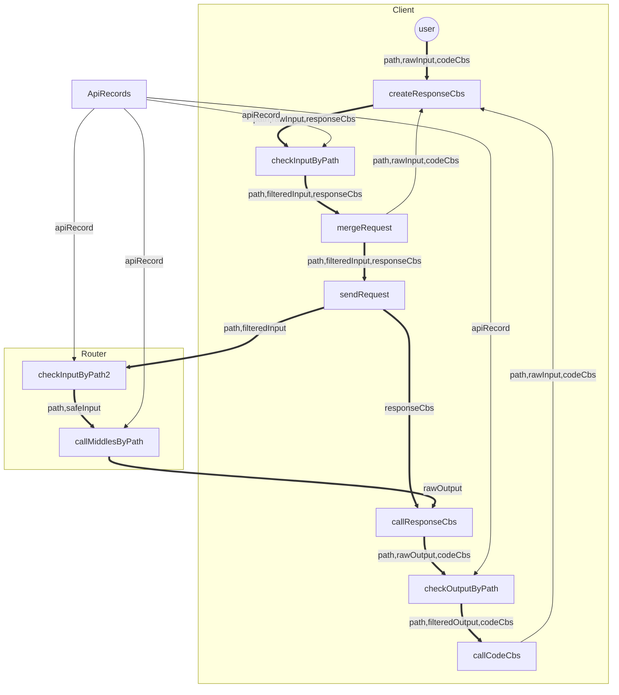

```mermaid
graph LR

```

| route | in           | out   |
| ----- | ------------ | ----- |
| /c    | least        | void  |
| /r    | id           | all   |
| /r/ls | page、filter | all[] |
| /u    | id、editable | void  |
| /d    | id           | void  |
