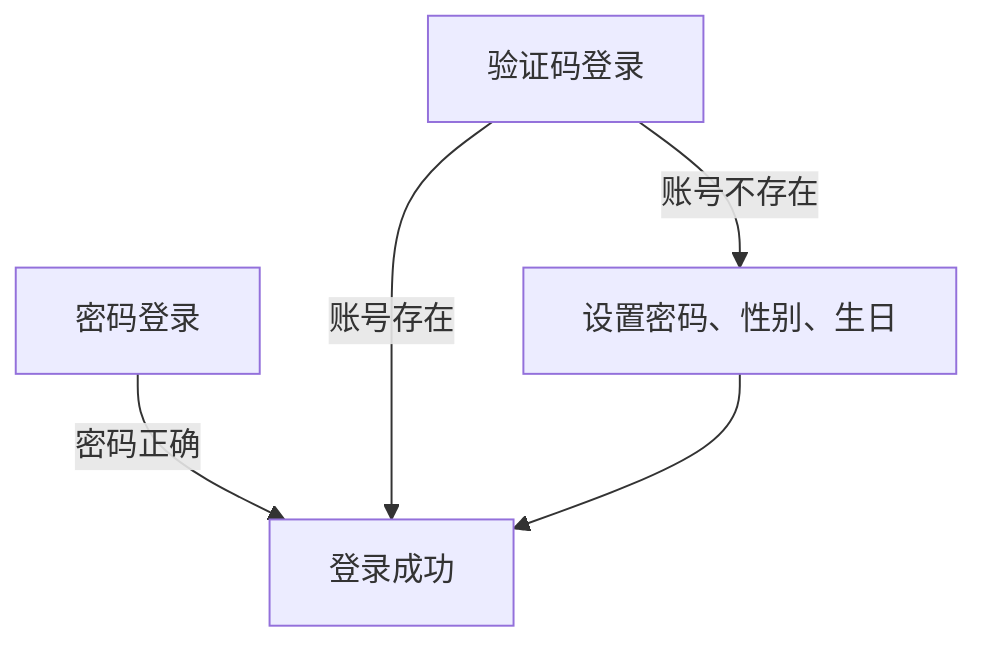
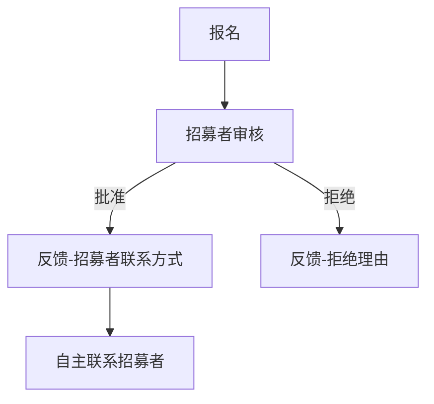
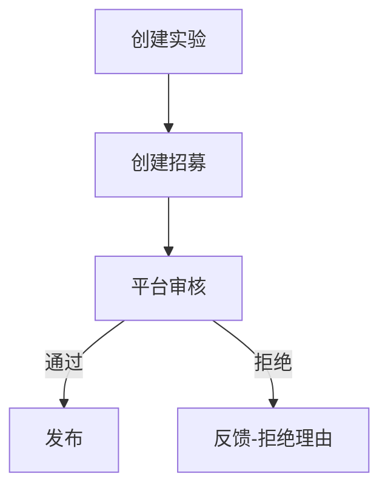
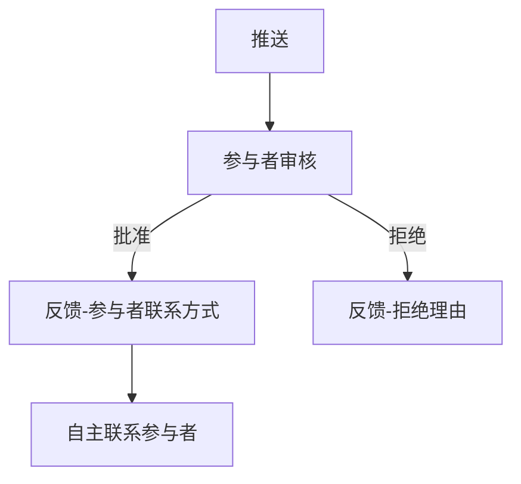

## 核心概念

- 用户：参与者、招募者
- 实验：承载招募信息
- 招募：招募信息
- 招募条件：参与者需要满足的条件
- 参与者库：招募者收集的参与者信息

## 交互流程

### 用户

```mermaid
graph
密码登录 -->|密码正确| 登录成功
验证码登录 -->|账号存在| 登录成功
验证码登录 -->|账号不存在| _["设置密码、性别、生日"] --> 登录成功
```

### 参与者

```mermaid
graph
报名 -->
招募者审核 -->|批准| 反馈-招募者联系方式 --> 自主联系招募者
招募者审核 -->|拒绝| 反馈-拒绝理由
```

### 招募者

```mermaid
graph
创建实验 --> 创建招募 --> 平台审核 -->|通过| 发布
平台审核 -->|拒绝| 反馈-拒绝理由
```

```mermaid
graph
推送 --> 参与者审核 -->|批准| 反馈-参与者联系方式 --> 自主联系参与者
参与者审核 -->|拒绝| 反馈-拒绝理由
```
