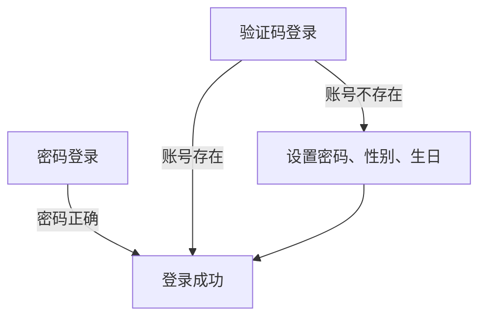
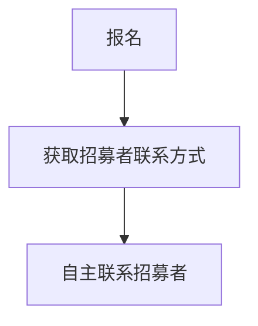
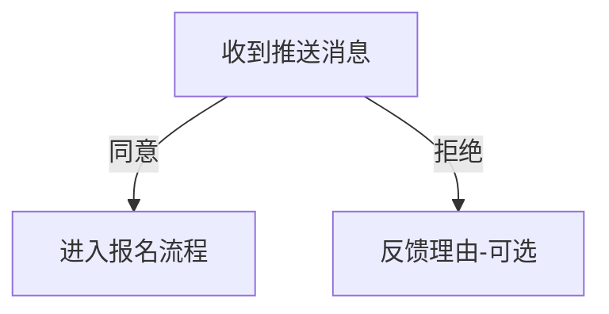
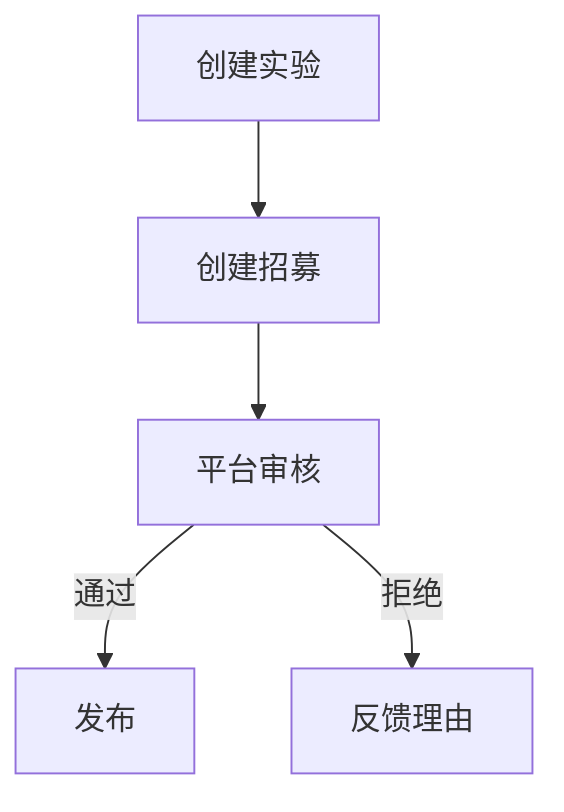
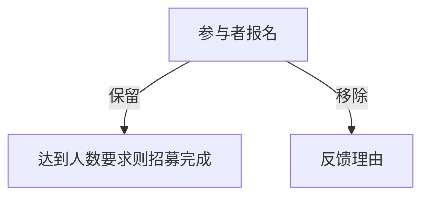

## 核心概念

- 用户：参与者、招募者
- 实验：承载招募信息
- 招募：招募信息
- 招募条件：参与者需要满足的条件
- 参与者库：招募者收集的参与者信息

## 交互流程

### 用户

### 参与者

### 招募者

## 路由

| 路由     | 状态                                                  |
| -------- | ----------------------------------------------------- |
| /public  | 实验列表 筛选范围 筛选数据 实验                       |
| /joined  | 实验列表 参与者类型 实验                              |
| /own     | 实验列表 实验状态 实验 招募条件 参与者列表 参与者类型 |
| /push    | 实验列表 实验 招募条件 参与者列表 参与者类型          |
| /message | 消息列表 消息类型 消息                                |
